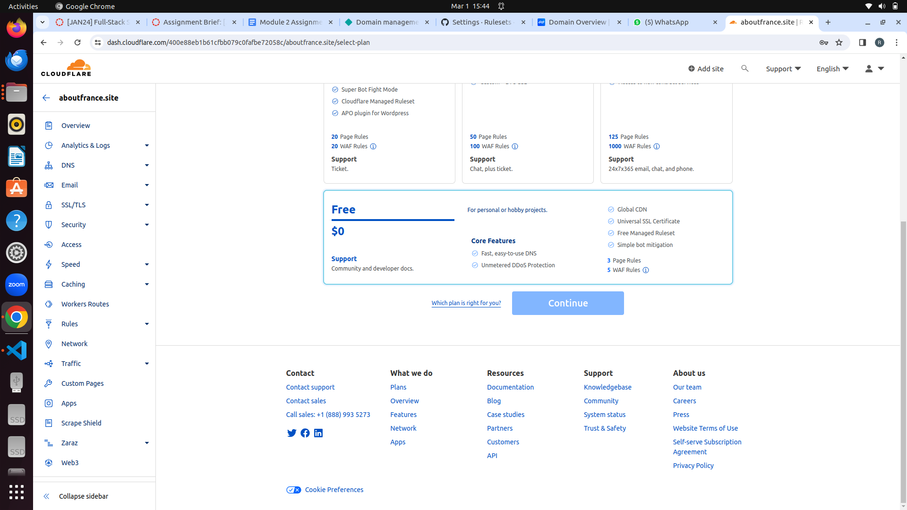

# What I Build in Week 1 Assignment

In this week 1 assignment, I created a website that describes how beautiful a place is, namely France. In this website, I included landmarks that are well known by various people in the world, then also introduced several landmarks in France. There are also videos that explain other landmarks in France. then to record data on visitors to the website, we also add a form that can be filled in by site visitors and get data on how many people are interested in knowing the beauty of France.

## Below is a display of the week 1 web assignment that I made

### URL of Website

You can access the website at:https://allaboutfrance.netlify.app/

#### My process in doing assignments
- Open Netlify on my laptop
  
- You can choose login or register, if you already have account you can choose what account you want use
  
- This the display after login 
  
- Select add new site and choose import an existing project
  
- I choose a deploy with github because my project https://github.com/RevoU-FSSE-4/module-2-ReyhanChandraBasuki/settingstra
- After clicking i will see a few repositories i have on github, after that i choose what repositories i want to deploy my project at module-2
  
  
- Netifly will progress my project deploy 
  
- After deploy the project, go to niagahoster website to buy a domain, first of all if not have account you all must register first
  
- Select the domain name i want use for my project, for my project i choose the cheap one
  
- After select the domain i want use, the website will direct me to payment
  
- After buy my domain, i go to cloudflare website,first of all must get an account if not can register first
  
- After register and login fill the name of my website
  
- After that the website direct me to what service i want use at cloudflare
  
- After that iam go to netlify to cek dns panel to connect with domain i buy
  
- At niagahoster i change my nameserver with netlify nameserver i get
  
  

##### This a result 
My project now has a domain and maybe it will take 24 hours to netlify so that the website can work
The Website link : https://aboutfrance.site/